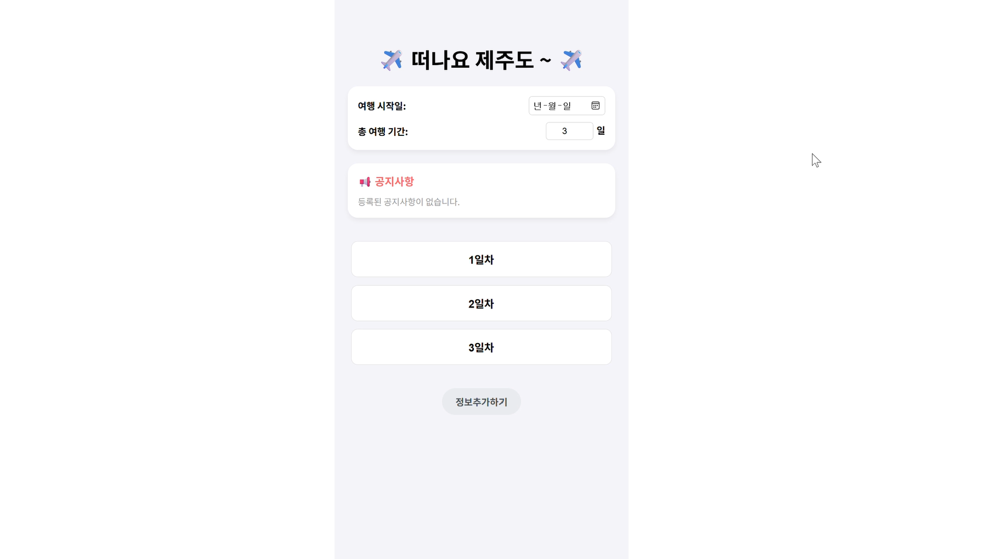
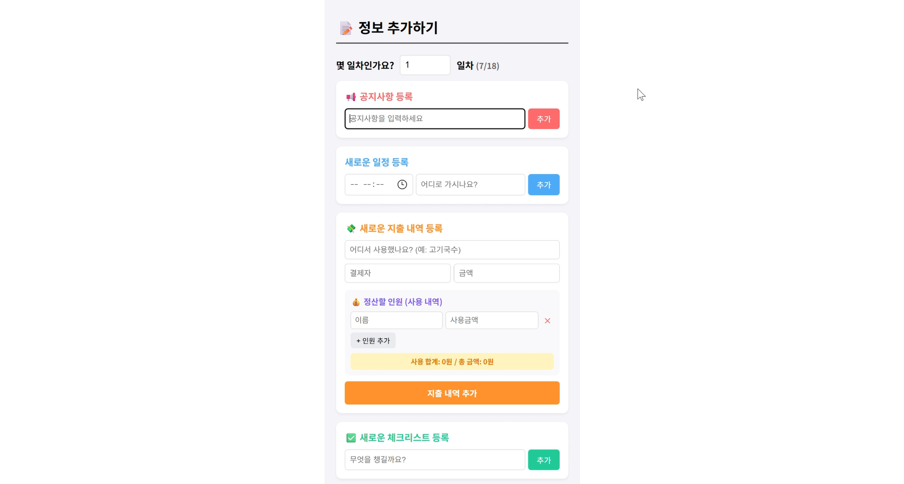
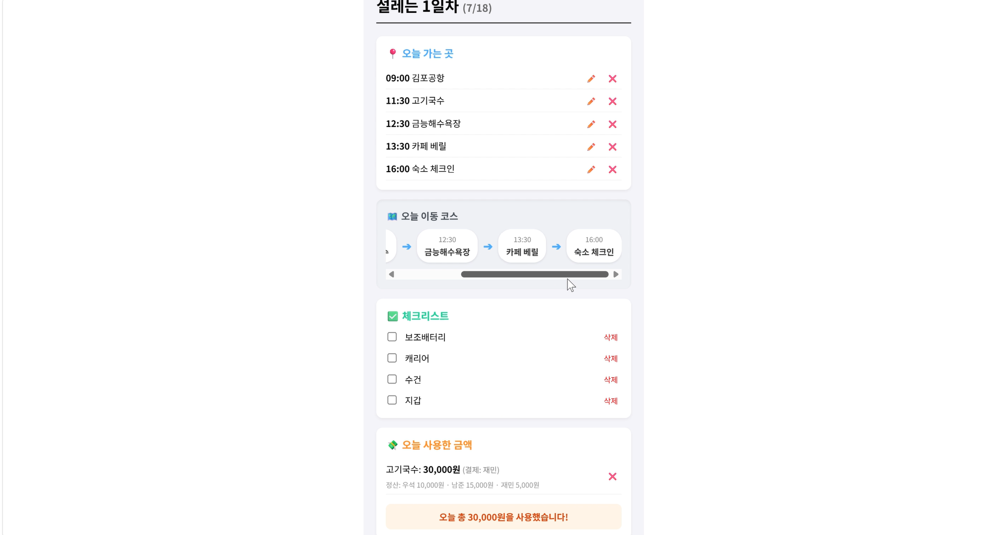

# ✈️ Jeju Plan Guide (제주 플랜 가이드)

> **"복잡한 여행 계획은 이제 그만, 제주도 여행을 스마트하게 관리하세요!"**
> 여행 일정 관리부터 지출 정산까지, 한 번에 해결하는 올인원 여행 플래너입니다.

---

## 📸 프로젝트 미리보기

| 메인 화면 | 상세 일정 | 정산 기능 |
| :---: | :---: | :---: |
|  |  |  |

---

## 💡 주요 기능 (Key Features)

*   **📍 스마트 일정 관리**: 여행 기간별 상세 일정을 등록하고 관리할 수 있습니다.
*   **🗺️ 이동 경로 타임라인**: 시간순으로 정렬된 이동 경로를 직관적인 타임라인 형태로 확인하세요.
*   **💸 N빵 정산 시스템**: 결제 내역과 분담 내역을 입력하면, 자동으로 정산 영수증을 생성해줍니다.
*   **✅ 여행 체크리스트**: 여행 전 준비물부터 일자별 할 일까지 놓치지 마세요.
*   **📢 공지사항**: 여행 중 꼭 확인해야 할 주요 일정을 첫 화면에서 바로 확인하세요.

---

## 🛠 기술 스택 (Tech Stack)

### **Frontend**
*   **React**: UI 컴포넌트 기반의 사용자 인터페이스 설계 및 상태 관리(`useState`, `useEffect` 활용).
*   **JavaScript**: ES6+ 문법을 활용한 동적 기능 구현 및 데이터 처리.
    * 
    * 

### **Backend & Database**
*   **Firebase Firestore**: NoSQL 기반의 실시간 데이터베이스를 활용한 여행 일정, 지출 내역, 체크리스트 데이터의 비동기 저장 및 동기화 구현.
    * 
    * 

### **Development Tools**
*   **Git**: 소스 코드 형상 관리 및 버전 관리.
*   **VS Code**: 프로젝트 개발 환경.
    * 
    * 

---

## 🚀 시작하기 (Getting Started)

### Prerequisites
*   Node.js 설치가 필요합니다.
*   [Firebase 프로젝트](https://console.firebase.google.com/) 생성이 필요합니다.

### Installation
1. 저장소 클론
   ```bash
   git clone https://github.com/banban9256/Jeju_Planner.git

2. 패키지 설치
    ```bash
    npm install```

3. 환경 변수 설정
    ```plaintext
    REACT_APP_FIREBASE_API_KEY=your_api_key
    REACT_APP_FIREBASE_AUTH_DOMAIN=your_auth_domain
    REACT_APP_FIREBASE_PROJECT_ID=your_project_id
    REACT_APP_FIREBASE_STORAGE_BUCKET=your_storage_bucket
    REACT_APP_FIREBASE_MESSAGING_SENDER_ID=your_messaging_id
    REACT_APP_FIREBASE_APP_ID=your_app_id
    REACT_APP_FIREBASE_MEASUREMENT_ID=your_measurement_id ```

4. 실행
    ```bash
    npm start```